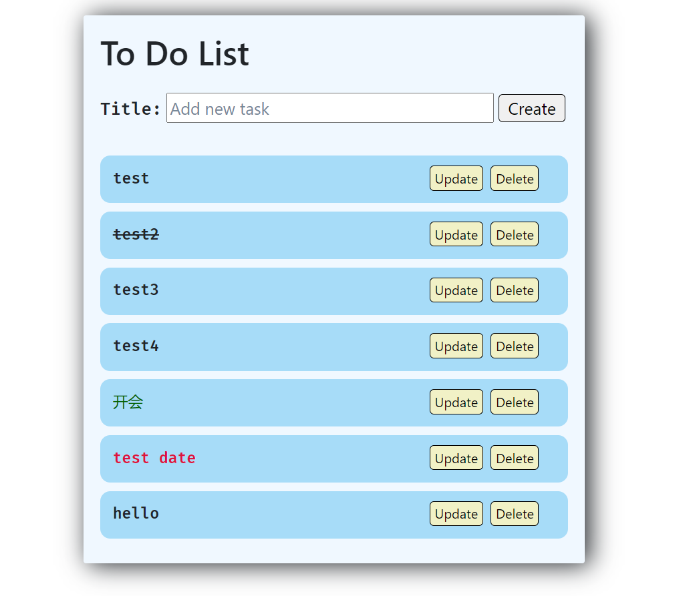
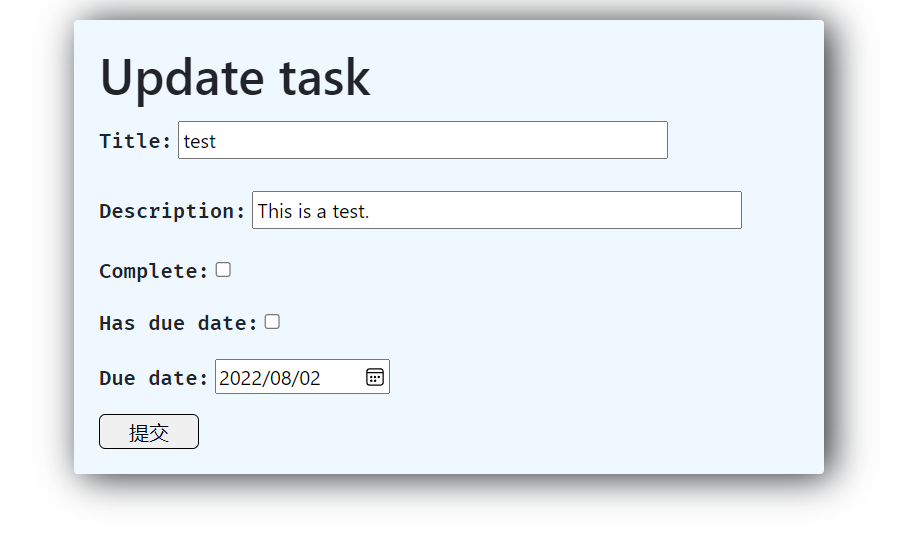
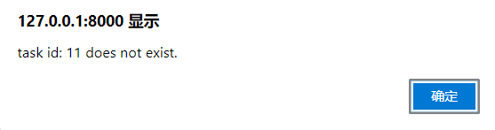

# Django 实现任务清单

## 项目介绍

### Django

**Django**是一个开源的Web应用框架，基于Python开发。Django的特点是采用**MTV (model-template-views)**的设计模式。

* **model**: 数据模型，用于数据存储的数据结构。此部分将由Django的中间件直接与数据库进行交互（读写）。另外，Django的数据库通常使用轻量级的`sqlite`，适合在本地运行，效率较高。
* **template**: 前端模板，由Django内核将其修改，并展示。由`HTML`\\ `javaScript`构成，中间增加模板语句（类似于C语言中的宏）。当执行**render**操作时，模板语句被展开为纯`HTML`\\ `javaScript`，可用于向前端网页填充内容信息。
* **views**: 视图，用于后端的逻辑运行。由`Python`语言构成，它决定了如何对数据模型进行修改，以及如何展示数据。

另外，Django还提供了丰富的模块和管理系统，方便用户快速搭建、管理站点。

### 任务清单

项目的目标是使用Django框架搭建一个任务清单应用，即`ToDo List`。主要实现任务记录、修改、提示等功能，并具有初步美化的界面。

项目参考：

* [30分钟！用Django做一个迷你的Todolist！上篇！ - 知乎 (zhihu.com)](https://zhuanlan.zhihu.com/p/405918963)

* [30分钟！用Django做一个迷你的Todolist！下篇！ - 知乎 (zhihu.com)](https://zhuanlan.zhihu.com/p/406501861)

## 功能要求

运行效果如下图所示：

### 前端

* 界面整洁、布局合理
* 为任务实现动态效果
  * 对今日需完成的任务提示
  * 警告已过期任务
* 任务提供两种展示方式
  * 列表展示，仅展示标题（可增加其他字段）
  * 详细信息，展示一个任务的所有信息
* 为后端功能提供所有需要的接口

### 后端

* 响应用户请求，并对数据做出对应修改
  * 增加
  * 修改
  * 删除
* 一个任务应至少包含以下字段
  * 标题
  * 描述（Optional）
  * 是否完成
  * 截止日期（Optional）
* 有一定鲁棒性，对错误处理（如不合理删除请求等）有异常提示

## 实现过程

### 框架搭建

参考网上相关资料，完成以下步骤

* django初始化环境配置
* 后台管理系统激活
* 创建应用

### 模型建立

* 根据**功能要求**中的数据模型，以及具体使用环境需求，设计数据模型
* 并根据数据模型建立表单（form）

### 设计路由

* 创建视图，并设计路由，连接相关视图
* 在视图中填充调试信息，以测试连通性

### 前端初步

* 设计简单前端，仅包含基础显示和基本操作接口
* 对前端操作接口进行相应后端连接

### 后端实现

* 利用前端的初始设计，完善后端连接方式
* 完成数据模型的展示、修改、数据对象删除等功能
* 构建后端功能逻辑

### 前端美化

* 精细化前端设计，增加结构以优化文档树

* 利用CSS等，对页面进行样式优化

## 评判标准

1. 提交内容
   1. 完整项目文件
   2. 前端运行功能、界面截图
   3. 项目使用说明
2. 提交项目文件要求
   * UTF-8编码
   * 包含项目依赖文件`requirements.txt`
3. 评判权重

   1. 功能实现（要求实现功能要求节中的所有内容）
      * 前端： 0.3
      * 后端： 0.2
      * 框架： 0.2
   2. 前端美化/附加实用功能 0.2
   3. 代码规范 0.1